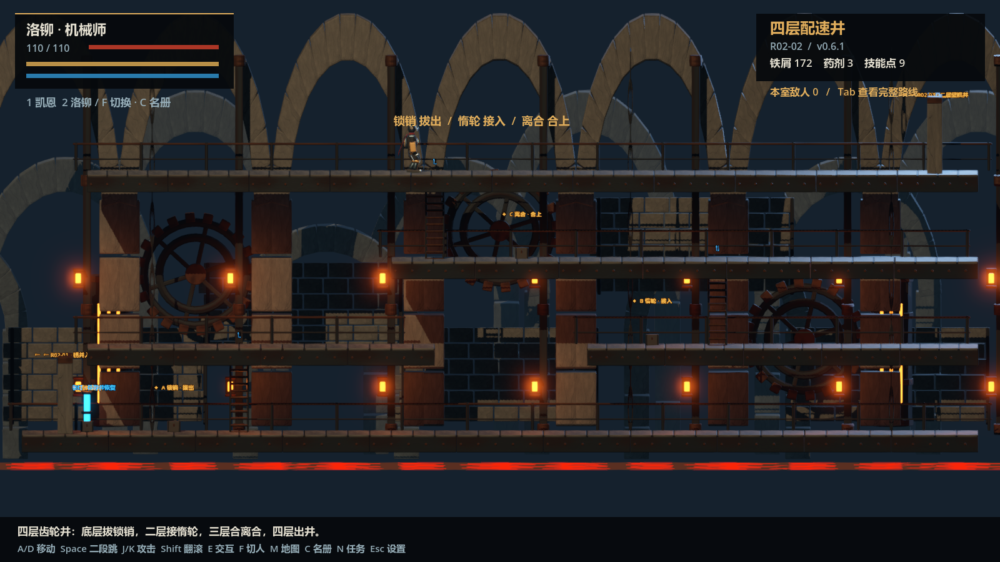
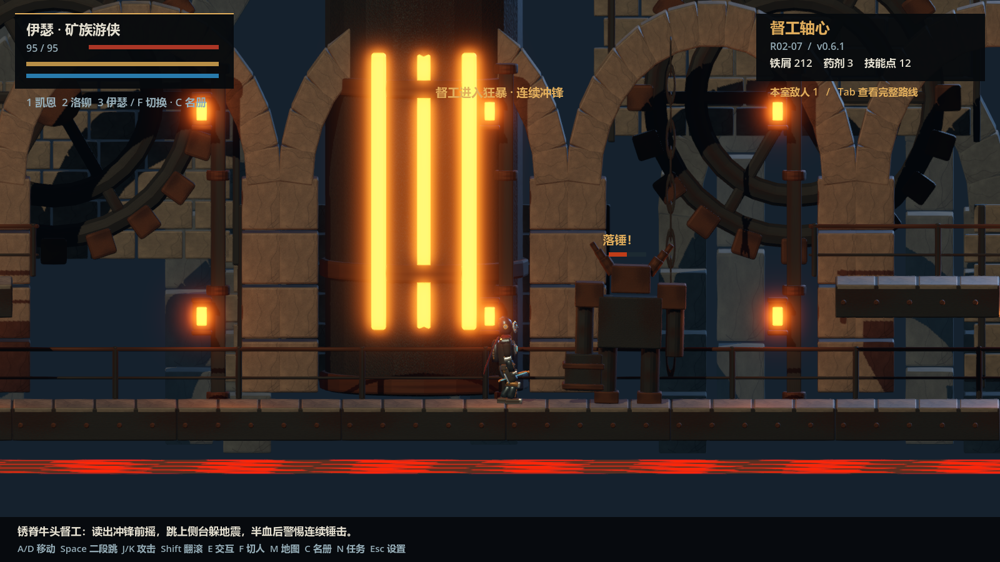
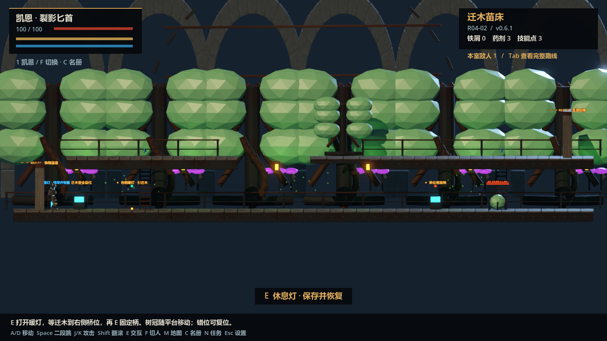
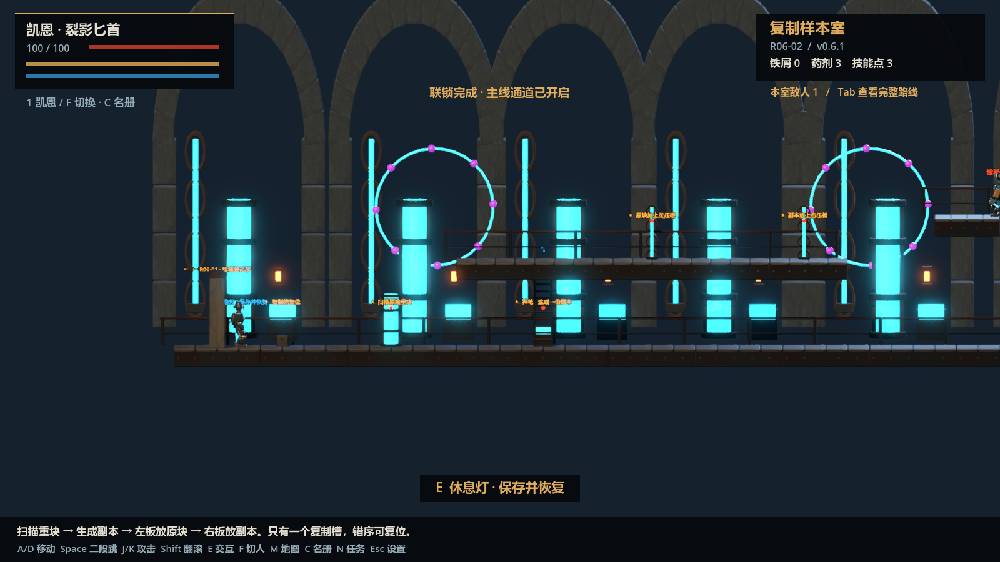

# 灰烬齿轮：裂界之心

Godot + Blender 制作的 2.5D 蒸汽暗黑动作探索游戏。当前版本 **0.6.1 · 动作与打击反馈**（2026-10-10）。

主线已扩展到灰闸囚厂、锈脊齿轮井、雾肺水务区、黑棘迁木园、夜血城堡和神笔实验室，加上维修所与矿牢，共 **50 个房间、七名可收集角色、六场 Boss 战**。当前为开发期可玩版本，原设计中的 R07—R12 与完整结局尚未开放。

## 游戏截图

以下来自当前 Windows 游戏 EXE 的实际运行。

**四层配速井：分层机关与竖梯**

**督工轴心：伊瑟与牛头督工**

**黑棘迁木园：引灯与移动树桥**

**神笔实验室：样本登记与双压板**

## 运行与发布

发布目录：`E:\Godot\release\灰烬齿轮-裂界之心-0.6.1\`。

压缩包：`E:\Godot\release\灰烬齿轮-裂界之心-0.6.1-Windows.zip`。

双击 **AshenGears.exe**，保持同目录 `AshenGears.pck`。老核显可尝试 **AshenGears-LowSpec.cmd** 的 OpenGL 兼容入口；普通入口提供完整 Forward+ 光影。Godot 打开 `project.godot`，Blender 源模型保存在 `source/`。原发布目录保留，新版本单独发布。

可继续 0.4 系列存档，保留奖励、Boss、装备与原同伴，补齐名册及生命字段。存档仍为 `ashen_save_v04.json`，位于 `%APPDATA%\Godot\app_userdata\灰烬齿轮：裂界之心\`。

## 推进与回访

- **右门继续，左门返回**：门上写出目的地。向右或向左走过门自动换房，也可 E 交互。第二章维修桥通向水务区；R06 最终运输梯才显示阶段完成，可以主动回访。
- **休息灯整备**：恢复全队与药剂、保存位置、调整三人编队、传送到已探索区域入口。普通敌人重新巡逻，奖励不重复；Boss 不复活。矿牢侧门和区域捷径保留独立返回位置。
- **独立房间路线**：保留输送带、压锤、钩索断桥、吊台、四层井、壁抓。新增水轮与水管、铁根与穹顶、血色尖拱与钟摆、实验罐与电能终端，平台、楼梯、竖梯、敌人、机关与收集目标逐房配置。
- **五套区域机关**：水位—旁路—排水；引灯—移动树桥—固定；双镜开锁；登记—复制—双压板；断电接线—绝缘—冷却上电。错序可复位。
- **六场 Boss**：典刑机、牛头督工、管喉之母、迁木女巫、血契侯爵、无面校稿者，带前摇、近击、实体弹道、地波、冲锋与半血强化。
- **任务与地图**：N 查看六条主线与证物，M 分区域查看已探索房间及前后连接，Tab 总览当前场景。战败与坠落在当前房间重试。

## 七名角色，三人出战

| 角色 | 招募位置 | 战斗区别 |
| --- | --- | --- |
| 凯恩 | 初始 | 匕首快攻；煤仓入口宝箱获得太刀，V 切换独立三连与重劈。 |
| 洛铆 | 灰闸断电囚门 | 重锤、破势、自身修补。 |
| 伊瑟 | 锈井轴承台中层侧门 → 矿牢 | 实体弓箭与远程支援。 |
| 沈烬 | 水务区折返维修梯 | 骨剑、往返飞刃、三次有效帧连斩。 |
| 纱隐 | 迁木园双忍藏室 | 双刃快攻、束缚、安全短位移。 |
| 维萝 | 夜血城堡血契炼金室 | 刺剑、血瓶、命中吸血。 |
| 零七 | 实验室活体四层仓顶层 | 电能拳刃、范围破势、临时减伤护盾。 |

C 查看名册；休息灯附近且脱离战斗时，选择角色编入 1/2/3 槽。F 轮换编队，数字键直接选择槽位。收集、HP、技能、编队存档，切換保留位置、速度及腾空次数。四名新同伴有八段新增 Blender 骨骼攻击动画，角色沿用 demo 骨架，目前仍是开发期模型。

全员初始二段跳；空冲训练、钩索与壁抓随探索解锁。保留冲跑、蹲行、翻滚、翻越、蹬墙、下砸、格挡、弹反、暗杀与命中顿帧。T 学习招式并在独立 3D 世界预览；药剂、宝箱、铁屑、三级武器强化继续可用。

0.6.1 根据项目动作 skills 加入局部顿帧、受击闪白与模型微抖、分级定向火花和有上限的震屏。轻击可在收招窗口衔接攻击或翻滚；输入有 220 毫秒有效期，顿帧中仍能提前输入，受伤和菜单会清除旧动作。原攻击伤害、距离、身法和美术保留。详见 [动作与打击反馈](docs/10_0.6.1动作与打击反馈.md)。

## 设置与性能

标题或 Esc → **设置**，分为：

- **氛围与画面**：高 / 中 / 低，默认屏幕原生分辨率，720p—4K、全屏 / 窗口、30—240 FPS 或不限、垂直同步、渲染比例、阴影、帧率显示、雾气、辉光与环境亮度。显示修改 15 秒确认，超时恢复。
- **音频**：总音量、动作战斗、音乐、环境分别调整，提供试听与恢复。57 个原创资源，20 路音效并发，探索 / 战斗 / Boss 配乐切换、区域环境淡入。
- **按键**：22 项动作分页改键并保存，拒绝重复与系统保留键，HUD 显示当前主要按键。方向键、鼠标、手柄默认布局保留。

5070 等设备默认高档，核显默认低档，其他设备默认中档。各档保留场景、纹理、动画和战斗特效；高档保留阴影、SSAO、辉光与 4×MSAA。优化采用相同纹理共享、静态部件分组合批、模型缓存、敌人感知查询间隔与弹道资源复用；物理保持 60 Hz。

`qa/performance_v061_*.json` 为当前 RTX 5070 Laptop GPU 的 1080p 测量，`performance_v06_*` 保留历史结果。GTX 1060 与核显尚未实机验收，不把当前设备结果当成低配帧率保证。

## 默认操作

| 操作 | 键盘 / 鼠标 | Xbox 布局 |
| --- | --- | --- |
| 移动 / 攀梯 | A D / W S，或方向键 | 左摇杆 |
| 冲跑 / 蹲行 | Alt / 地面 S | 蹲行：摇杆向下 |
| 跳跃 / 二段跳 / 离梯 / 脱钩 / 蹬墙 / 翻越 | Space | A |
| 轻击 / 重击 / 空中下砸 | J K / 鼠标左右键 | X Y |
| 翻滚 / 格挡 | Shift / L | B / LB |
| 技能 / 空冲 | Ctrl + J K / Ctrl + Space | RB + X Y / RB + A |
| 交互 / 暗杀 / 休息 / 吊台 | E | 十字键上 |
| 按住预选 / 松开发射钩索 | Q | LT |
| 切換当前编队 | F 或 1 / 2 / 3 | RT |
| 凯恩换匕首 / 太刀 | V | 右摇杆按下 |
| 药剂 | R | 十字键下 |
| 地图 / 技能 / 名册 / 任务 | M / T / C / N | View；其余从休息灯或菜单进入 |
| 标记薄壁相移 | G，需先学习 | — |
| 场景总览 / 暂停 / 全屏 | Tab / Esc / F11 | Menu 暂停 |

## 开发与验收

原三份设计文档保存在 `docs/`。更新见 [0.6.0 区域与同伴](docs/09_0.6.0区域与同伴.md)、[0.6.1 动作与打击反馈](docs/10_0.6.1动作与打击反馈.md)，历史文档保留。动作参考 skills 在 `docs/action/astra-godot-action-skills/`；调参入口为 `scripts/action_tuning.gd`。

工具：`source/build_v06.py`（Blender），`source/rooms_v06.py`（房间），`source/build_audio_v06.py`（原创环境循环），`source/package.ps1`（导出、实际 EXE 验收、哈希核对与发布）。不删除或重建 `.git`。

验收见 [qa/VERIFICATION.md](qa/VERIFICATION.md)、`qa/runtime_tests.json` 与 `qa/v06_runtime.json`。报告绑定实际 EXE / PCK 的 SHA256，发布目录和压缩包逐项核对哈希。自动验收覆盖局部真实输入、物理及状态样本，尚未替代完整人工通关和实体手柄测试。
