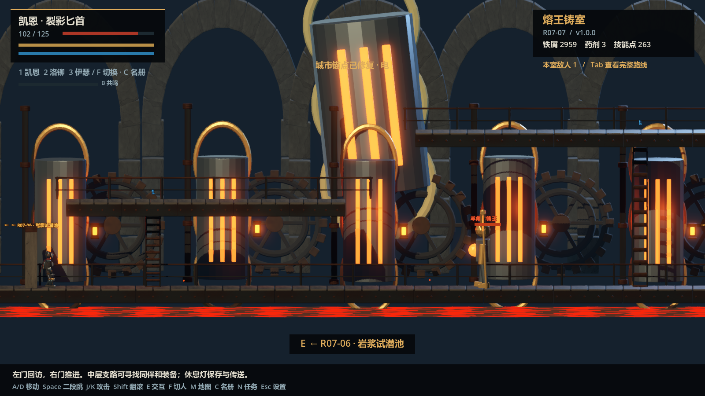
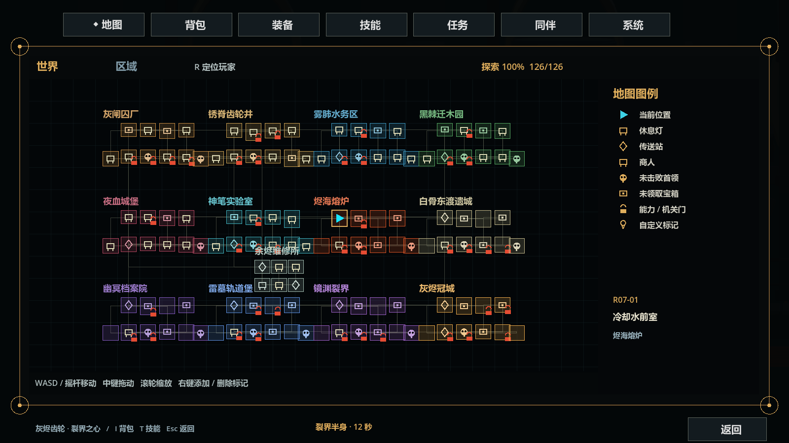
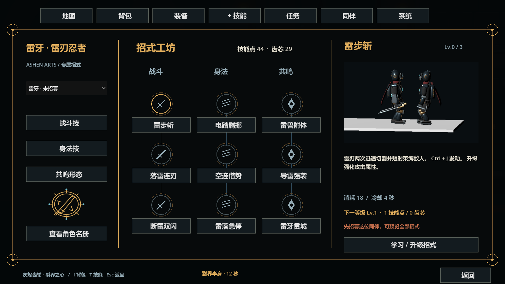
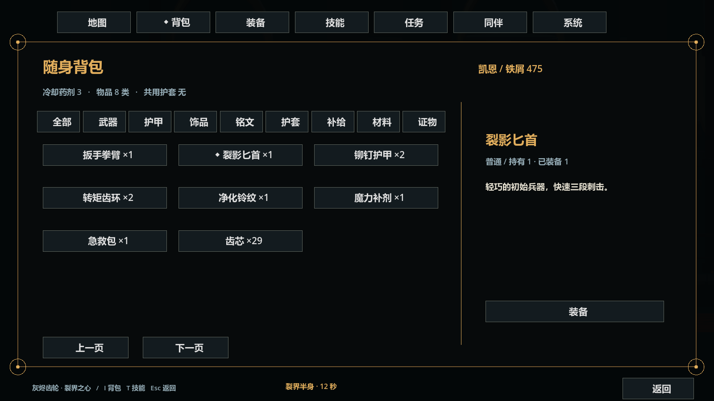

# 灰烬齿轮：裂界之心

Godot + Blender 制作的 2.5D 蒸汽暗黑动作探索游戏。**1.0.0 · 策划验收版**。

目前开放从灰闸囚厂到灰烬冠城的十二章主线、维修所、每区两条支路，共 **126 个房间、主角与 16 名可招募同伴、12 场主线 Boss 和 8 个隐藏精英**。主线到达炉心后提供三个可记录的结局，并允许回终战前补做探索。这是供策划检验的完整流程版本，商业发布验收尚待人工完成。

## 实机截图

以下截图由对应 Windows EXE 的隔离验收场景生成；地图截图展示全探索状态，技能截图展示独立查看候补人物，不代表新档已经解锁全部内容。

**烬海熔炉：羊角熔铸王与多层炉台**

**世界地图：区域、双向通路与探索标记**

**雷牙的专属学习界面：技能树、动画预览与学习条件**

**背包：物品数量、分类与真实装备属性**

## 运行

发布目录：`E:\Godot\release\灰烬齿轮-裂界之心-1.0.0\`。

启动程序：`AshenGears.exe`，同目录保留 `AshenGears.pck`。压缩包为 `灰烬齿轮-裂界之心-1.0.0-Windows.zip`。旧版发布目录保留。

核显或旧显卡可尝试 `AshenGears-LowSpec.cmd`，使用 OpenGL 兼容渲染与低档。普通入口使用 Forward+。设置分为**氛围与画面 / 音频 / 按键**，提供高中低画质、屏幕原生分辨率、帧率上限、垂直同步、雾气、辉光、亮度和阴影；分辨率修改有超时回退。高中低保留模型、动作、粒子、地形和材质细节，主要调整渲染比例、实时光源预算、阴影和屏幕空间效果。

旧 0.4 / 0.6 存档兼容，房间与原角色编号保留。存档路径：`%APPDATA%\Godot\app_userdata\灰烬齿轮：裂界之心\ashen_save_v04.json`，采用临时写入与备份恢复。新档从匕首和二段跳开始，煤仓补给箱获得太刀。

## 操作

| 功能 | 默认键 |
| --- | --- |
| 移动 / 攀梯 / 蹲行 | A D / W S |
| 跳跃 / 初始二段跳 | Space |
| 轻击 / 重击 / 空中下砸 | J / K / 空中 K；鼠标左右键也可攻击 |
| 冲跑 / 翻滚 / 格挡弹反 | Alt / Shift / L |
| 专属技能 / 高阶招式 | Ctrl + J / K；Ctrl + Shift |
| 空中冲刺 | Ctrl + Space，需身法训练或学习 |
| 共鸣形态 / 共鸣终式 | B；形态中 Ctrl + Shift，需学习及资源 |
| 钩索 / 薄壁相移 | Q / G，需取得对应工具 |
| 交互 / 同伴轮换 / 队内选择 | E / F / 1 2 3 |
| 匕首与太刀切换 / 快捷药剂 | V / R |
| 地图 / 技能 / 名册 / 任务 | M / T / C / N |
| 背包 / 装备 / 场景总览 | I / O / Tab |
| 暂停 / 全屏 | Esc / F11 |

Xbox 默认支持移动、跳跃、轻重击、翻滚、格挡、技能修饰、钩索、换人、交互和药剂。复杂管理界面可使用鼠标；实体手柄全面检验仍待策划测试。

## 世界与系统

- **推进与回访**：右门推进、左门返回；支路两侧出口回对应主路，门标出实际目的地。R06 运输梯继续 R07，R12 炉心才进入最终选择。休息灯可以调整三人编队、补给和前往已探索区域入口。
- **空间地图**：世界 / 区域视图，WASD、摇杆和中键平移，滚轮缩放，R 定位，右键添加 / 删除持久标记。未探索房间保留迷雾，图例包含首领、宝箱、能力门、休息灯和传送站。
- **专属学习**：17 套树、每人 9 个命名节点、每节点 3 级。左侧选择人物，中央分战斗 / 身法 / 共鸣，右侧动画、说明、前置、材料与升级。名册“查看此人技能”直达选中人物；候补人物的学习和当前出战人物独立。
- **背包与装备**：武器、护甲、双饰品、铭文和全队环境护套；消耗品、材料和证物分栏。装备实际改变生命、防护、输出与回复，同一实体物品按拥有数量分配。候补角色可在装备页选择。商店和六个配方需要安全休息灯，证物不可出售。
- **战斗**：匕首与太刀独立招式，17 个职业的近战、弓箭、符墨、手炮、龙息、治疗、骨仆、贯穿弹等；保留局部顿帧、受击闪白、定向火花、弹反、输入缓冲与安全中断。12 个主线 Boss 有预警和半血强化，8 个精英保存唯一击败状态。
- **委托与结局**：12 条主线记录，20 条支线和 8 条隐藏委托。当前委托使用接取、邻室证物、返回清敌交付的闭环，并非原策划文档每条完整剧情演出。炉心结局由米菈意愿和水 / 气 / 电锚点决定。
- **音效与氛围**：跳跃、冲刺、挥击、命中、落地、梯子、钩索、弹反、机关、环境及战斗声音；63 个音频资源，区域床声、战斗与 Boss 层随状态切换，音量分类保存。

## 开发与验收

实际 Windows EXE 的 **310 项运行检查、179 项资源检查均零失败**；同包 OpenGL 低档验证 13 个代表房间，运行错误日志为空。三档性能已在当前 RTX 5070 Laptop、1080p 环境测量，完整结果和条件见验证记录。

Godot 打开 `project.godot`。Blender 原文件在 `source/`；新增十个人物、十四类敌人 / Boss、十个后半程场景零件使用原创模型与骨骼动画，沿用通道 Demo 的材质和造型基础。参考图只用于系统结构与氛围参考，未复制其素材。

- [策划验收指南](docs/11_1.0.0策划验收指南.md)：路线、招募位置、结局条件、系统验收及问题模板。
- [验证记录](qa/VERIFICATION.md)：实际 EXE、资源、兼容渲染与性能测量的范围。
- `python source/rebuild_data_v10.py`：从固定 0.6.1 基线及原设计文档重建房间、角色、委托和技能数据，不重建旧模型。
- Blender：依次运行 `source/build_v10.py`、`source/animate_enemies_v10.py`；音频生成 `source/build_audio_v10.py`。原资产及 `.git` 保留。
- `source/package.ps1`：导出、运行 EXE 验收和 OpenGL 冒烟、绑定 EXE/PCK 哈希、发布并校验 ZIP；存在同名发布目录时停止覆盖。

美术为可测试的模块化原型，153 个节点不等于 153 套独立动画：职业招式使用独立动作，部分高阶、被动与共鸣预览复用动作。完整人工通关、数值平衡、视觉演出质量、目标核显 / GTX 1060、实体手柄和商业发布审查待验收。
