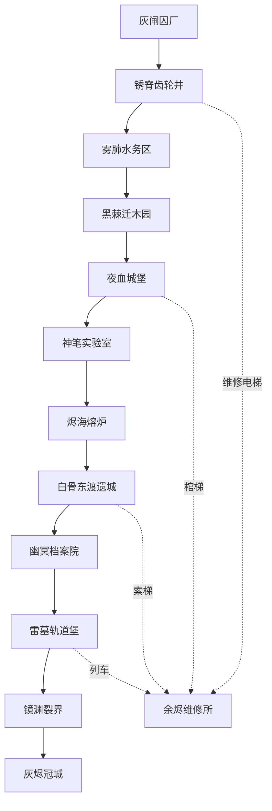

# 《灰烬齿轮：裂界之心》 — 完整地图与关卡设计

版本：1.0 · 2026-10-09。性质：原创游戏制作设计基线；全部数值为首次实现和试玩调参起点，不是已测结论。

技术路线：Blender 制作 3D 场景、角色、骨骼动画；Godot 4 稳定版制作 2.5D 横版游戏。立项时锁定具体引擎与 Blender 版本，不在制作中自动升级。

配套文档：[02_玩法与开发设计.md](02_玩法与开发设计.md)；[03_剧情与世界观.md](03_剧情与世界观.md)。区域、任务、角色、能力 ID 在三份文档中保持一致。

## 1. 地图体验与规模

这是一个连续探索、能力解锁、回访开启捷径的地下城。横向行动决定战斗节奏，纵向通道决定地图记忆。玩家应在获得新能力后立刻想起至少一个旧区域的未达位置。地图采用手工房间与固定故事结构；仅挑战地下城的小型战斗布局可随机，不随机化主线关键物、招募条件或剧情证据。

完整版本目标：R00 中枢 6 房＋R01—R12 各 8 个主房＋每区 2 个支／隐藏房＝126 个逻辑房。逻辑房不是载入场景或屏幕数量；大型竖井可占 3—4 屏。目标首次通关 18—24 小时，完整探索 28—36 小时，需在内容制作后用真人测试验证。单房典型游玩 2—6 分钟；Boss 和谜题房可以更长。不用计时硬凑时长。

完整版包含 12 个主线 Boss、8 个精英支线 Boss、16 位可招募同伴。不要求首个版本一次生产这些内容；第 15 节定义小规模可交付样片。

## 2. 世界结构与主线门

R00「余烬维修所」为枢纽，提供队伍编成、工坊、仓库、地图和快速移动。新区域的边界通常在击败当地 Boss 或完成关键机关后永久开放。能力教学房早于对应能力门；主线不因可选同伴未招募而封死。



图表示大区进入次序；返回旧区没有重新消耗钥匙的要求。R03、R06、R07、R09、R11 的返城端接入已解锁的 R00 传送网络；R01 初次只能沿 R02 出口前进，R02 中段才建立中枢。R12 入场前明确提示终战，但仍能返回。击败最终 Boss 不覆盖探索存档，载入回到终战前。

能力门的持久判定为 `party_progress.abilities`。当前出战角色可使用公用环境工具；职业特色可给出更快解法和特殊奖励，不能是主线唯一解。

| 能力 ID | 名称 | 首次获得 | 环境用途 | 主线使用 | 回访样例 |
| --- | --- | --- | --- | --- | --- |
| A01 | 锚点钩索 | R01-05 | 抓标记墙面锚点并弹射／摆荡 | R01-06、R02-01 | R01-H1 |
| A02 | 壁抓与壁跳 | R02-03 | 可抓墙面短暂停留并反向起跳 | R02-04、R03-01 | R02-H2 |
| A03 | 二段跳 | R03-05 | 空中再跳一次，落地复位 | R03-06、R04-01 | R01-H2 |
| A04 | 空中冲刺 | R04-04 | 空中一次短冲刺，落地复位 | R04-06、R05-01 | R03-H2 |
| A05 | 裂隙步 | R05-06 | 穿过标记薄壁，使用前确认安全落点 | R05-07、R06-01 | R04-H2 |
| A06 | 电链导通 | R06-06 | 操作导电端子和电源路由 | R06-07、R07-01 | R02-H1 |
| A07 | 熔界潜行 | R07-05 | 护套装备模式，可短时入岩浆 | R07-06、R07-07 | R07-H2 |
| A08 | 重锚牵引 | R08-05 | 拖动重锚物与指定重门 | R08-06、R09-01 | R06-H2 |
| A09 | 真视灯 | R09-05 | 显露隐藏表面、回声文字与伪装怪 | R09-06、R10-01 | R05-H2 |
| A10 | 轨链滑行 | R10-03 | 沿指定电轨高速滑行，节点可下车 | R10-06、R11-01 | R08-H2 |
| A11 | 共鸣封界 | R11-06 | 统一工具轮执行三源封印 | R11-07、R12-01 | R10-H2 |

## 3. 中枢房间

| 房间 ID | 名称 | 功能 | 邻接 |
| --- | --- | --- | --- |
| R00-01 | 余烬广场 | 存档、编队、地图、传送 | 02、03、04、06；R02-08 |
| R00-02 | 洛铆工坊 | 装备升级、环境护套、材料兑换 | 01、05 |
| R00-03 | 夜行客栈 | 同伴对话、个人任务、未出战成员 | 01 |
| R00-04 | 灰街交易所 | 合法怪物标本、遗物、有限商品 | 01 |
| R00-05 | 绘笔分站 | 蓝图与固定素材配方；R06 后开放 | 02 |
| R00-06 | 封界站台 | 已发现传送点、区域完成度 | 01；R05-08、R08-08、R10-08 |

## 4. 十二大区概览

| 区域 | 视觉材料 | 能力 | 同伴 | 主线 Boss | 机制 |
| --- | --- | --- | --- | --- | --- |
| R01 灰闸囚厂 | 煤灰、铁栅、滴油的刑具 | A01 钩索锚点 | C01 机械师 | B01 链狱典刑机 | 输送带、断电门、双层竖梯 |
| R02 锈脊齿轮井 | 四层巨大齿轮、悬链与蓝色电弧 | A02 壁抓与壁跳 | C02 暗夜游侠 | B02 锈脊牛头督工 | 四层竖井、齿轮配速、可挂钩墙面 |
| R03 雾肺水务区 | 绿铜水管、污水、蒸汽与幽影 | A03 二段跳 | C03 骷髅剑客 | B03 管喉之母 | 三层水位、压力阀、折返楼梯 |
| R04 黑棘迁木园 | 地下毒林、铁根、玻璃穹顶 | A04 空中冲刺 | C04 影织忍者、C05 雷刃忍者 | B04 迁木女巫 | 可移动树木、根系转盘、孢子气流 |
| R05 夜血城堡 | 封闭哥特堡、血液导管与齿轮钟 | A05 裂隙步 | C06 吸血鬼炼金术士 | B05 血契侯爵 | 光束与暗门、钟摆、假镜面 |
| R06 神笔实验室 | 机械绘笔、活体培养舱、晶蓝电路 | A06 电链导通 | C07 魔法科技狂人、C08 电能改造人 | B06 无面校稿者 | 电链路由、绝缘桥、绘笔复制 |
| R07 烬海熔炉 | 岩浆、黑铁祭坛、煤红火花 | A07 熔界潜行装备许可 | C09 蒸汽机器人、C10 驯龙师 | B07 羊角熔铸王 | 四层热井、蒸汽升降机、炉门时序 |
| R08 白骨东渡遗城 | 东方木檐、骨灯、旧船坞与电纹 | A08 重锚牵引 | C11 光刃剑客、C12 枪炮师 | B08 白骨将军 | 翻墙、滑轮重门、四层战斗楼 |
| R09 幽冥档案院 | 亡灵书柜、封印钟、回声池 | A09 真视灯 | C13 亡灵法师、C14 牧师 | B09 千名亡灵法官 | 名字排序、回声桥、三层档案电梯 |
| R10 雷墓轨道堡 | 磁轨、雨水、电链与炮台 | A10 轨链滑行 | C15 神射手 | B10 风暴蝎帝 | 移动列车、轨链挂点、断电安全舱 |
| R11 镜渊裂界 | 倒置城片、紫黑裂缝、异次元水 | A11 共鸣封界 | C16 星烬魔法师 | B11 裂界三相兽 | 重力房、跨层镜桥、三类能量锁 |
| R12 灰烬冠城 | 悬空王座、巨型炉心与暗日 | 最终整合考验 | 无新增强制招募 | B12 灰冠摄政·赫律 | 四层最终竖井、炉心三锁、处决舞台 |

## 5. 主房间清单与连接

下表列出每个房间的目的、连接和奖励。`⇄` 表示可往返；`→` 表示首次单向推进；捷径开放后可反走。主通路按 01 至 08 串接，门的具体条件以能力矩阵与本表为准。隐藏房连接在第 6 节。

### R01 灰闸囚厂

区域任务：救出机械师，关闭囚厂人类转化线。敌群：黑市人类守卫、机械犬、半机械囚徒。布局约束：拿到钩索后在同房间练习，不以同伴角色做硬门。

| 房间 ID | 名称 | 节奏角色 | 基本邻接 | 内容与条件 | 奖励 |
| --- | --- | --- | --- | --- | --- |
| R01-01 | 煤仓醒室 | 安全前室／地图提示 | 序章入口 ⇄ R01-01 ⇄ R01-02 | 安全观景、存档点；展示远处目的地，首次战斗前可整备 | 地图局部揭示 |
| R01-02 | 巡逻暗道 | 机制单独教学 | R01-01 ⇄ R01-02 ⇄ R01-03 | 输送带独立教学；单敌验证读招，完成后出现原路捷径提示 | 材料宝箱／固定怪物材料 |
| R01-03 | 压料车间 | 纵向移动考验 | R01-02 ⇄ R01-03 ⇄ R01-04 | 三或四层连续通道；中层横支路与上方威胁，先看落点再移动 | 材料宝箱／固定怪物材料 |
| R01-04 | 断电囚门 | 机制组合与战斗 | R01-03 ⇄ R01-04 ⇄ R01-05 | 两类已学机关组合；前景遮挡自动淡出，设置安全恢复台 | 材料宝箱／固定怪物材料 |
| R01-05 | 钩索维修台 | 能力／剧情奖励 | R01-04 ⇄ R01-05 ⇄ R01-06 | 剧情交互／宝箱；发放本区能力关联蓝图或人物证据：A01 钩索锚点；完成教学即获得 锚点钩索 | 永久能力：锚点钩索 |
| R01-06 | 刑柱竖井 | 预 Boss 检查与捷径 | R01-05 ⇄ R01-06 ⇄ R01-07 | 能力综合验收；Boss 前存档、补给和退路；未满足门条件可返回教学房 | 存档与补给 |
| R01-07 | 典刑机大厅 | Boss／关键目标 | R01-06 ⇄ R01-07 ⇄ R01-08 | B01 链狱典刑机；R12 此房为摄政战，下一房为炉心选择，不另塞突袭 Boss | Boss 唯一核心＋任务旗标 |
| R01-08 | 逆向出货门 | 永久回环／区域出口 | R01-07 ⇄ R01-08 ⇄ R02-01 | 永久打开回环，记录区域完成；解锁下一大区／中枢连接 | 捷径旗标 |

区内捷径：完成 R01-06 的手动开门机关后，R01-06 ⇄ R01-02；完成 Boss 后 R01-08 ⇄ R01-01。两条捷径分别服务战前往返与回访探索，不跳过首次能力教学。

### R02 锈脊齿轮井

区域任务：取得总井图纸，打开城市维修中枢。敌群：牛头人、投石触手、齿轮机关人。布局约束：壁跳必经教学；远处高台预告二段跳。

| 房间 ID | 名称 | 节奏角色 | 基本邻接 | 内容与条件 | 奖励 |
| --- | --- | --- | --- | --- | --- |
| R02-01 | 锈井入口 | 安全前室／地图提示 | R01-08 ⇄ R02-01 ⇄ R02-02 | 安全观景、存档点；展示远处目的地，首次战斗前可整备 | 地图局部揭示 |
| R02-02 | 一层配速室 | 机制单独教学 | R02-01 ⇄ R02-02 ⇄ R02-03 | 四层竖井独立教学；单敌验证读招，完成后出现原路捷径提示 | 材料宝箱／固定怪物材料 |
| R02-03 | 二层壁抓井 | 纵向移动考验 | R02-02 ⇄ R02-03 ⇄ R02-04 | 三或四层连续通道；中层横支路与上方威胁，先看落点再移动；完成教学即获得 壁抓与壁跳 | 永久能力：壁抓与壁跳 |
| R02-04 | 三层投石廊 | 机制组合与战斗 | R02-03 ⇄ R02-04 ⇄ R02-05 | 两类已学机关组合；前景遮挡自动淡出，设置安全恢复台 | 材料宝箱／固定怪物材料 |
| R02-05 | 四层轴承台 | 能力／剧情奖励 | R02-04 ⇄ R02-05 ⇄ R02-06 | 剧情交互／宝箱；发放本区能力关联蓝图或人物证据：A02 壁抓与壁跳 | 证据／职业蓝图（本区能力具体位置见第2节） |
| R02-06 | 牛头备料场 | 预 Boss 检查与捷径 | R02-05 ⇄ R02-06 ⇄ R02-07 | 能力综合验收；Boss 前存档、补给和退路；未满足门条件可返回教学房 | 存档与补给 |
| R02-07 | 督工轴心 | Boss／关键目标 | R02-06 ⇄ R02-07 ⇄ R02-08 | B02 锈脊牛头督工；R12 此房为摄政战，下一房为炉心选择，不另塞突袭 Boss | Boss 唯一核心＋任务旗标 |
| R02-08 | 维修桥回环 | 永久回环／区域出口 | R02-07 ⇄ R02-08 ⇄ R03-01 | 永久打开回环，记录区域完成；解锁下一大区／中枢连接 | 捷径旗标 |

区内捷径：完成 R02-06 的手动开门机关后，R02-06 ⇄ R02-02；完成 Boss 后 R02-08 ⇄ R02-01。两条捷径分别服务战前往返与回访探索，不跳过首次能力教学。

### R03 雾肺水务区

区域任务：排干进城通路，找到裂界血样。敌群：水下鳗魔、食尸鬼、蝙蝠魔。布局约束：排水与再注水都可操作；无潜水能力也能通主线。

| 房间 ID | 名称 | 节奏角色 | 基本邻接 | 内容与条件 | 奖励 |
| --- | --- | --- | --- | --- | --- |
| R03-01 | 干管入口 | 安全前室／地图提示 | R02-08 ⇄ R03-01 ⇄ R03-02 | 安全观景、存档点；展示远处目的地，首次战斗前可整备 | 地图局部揭示 |
| R03-02 | 蒸汽泄压厅 | 机制单独教学 | R03-01 ⇄ R03-02 ⇄ R03-03 | 三层水位独立教学；单敌验证读招，完成后出现原路捷径提示 | 材料宝箱／固定怪物材料 |
| R03-03 | 下水三层井 | 纵向移动考验 | R03-02 ⇄ R03-03 ⇄ R03-04 | 三或四层连续通道；中层横支路与上方威胁，先看落点再移动 | 材料宝箱／固定怪物材料 |
| R03-04 | 折返维修梯 | 机制组合与战斗 | R03-03 ⇄ R03-04 ⇄ R03-05 | 两类已学机关组合；前景遮挡自动淡出，设置安全恢复台 | 材料宝箱／固定怪物材料 |
| R03-05 | 浮筒跳跃槽 | 能力／剧情奖励 | R03-04 ⇄ R03-05 ⇄ R03-06 | 剧情交互／宝箱；发放本区能力关联蓝图或人物证据：A03 二段跳；完成教学即获得 二段跳 | 永久能力：二段跳 |
| R03-06 | 管喉育巢 | 预 Boss 检查与捷径 | R03-05 ⇄ R03-06 ⇄ R03-07 | 能力综合验收；Boss 前存档、补给和退路；未满足门条件可返回教学房 | 存档与补给 |
| R03-07 | 母体排水室 | Boss／关键目标 | R03-06 ⇄ R03-07 ⇄ R03-08 | B03 管喉之母；R12 此房为摄政战，下一房为炉心选择，不另塞突袭 Boss | Boss 唯一核心＋任务旗标 |
| R03-08 | 阀闸回城口 | 永久回环／区域出口 | R03-07 ⇄ R03-08 ⇄ R04-01 | 永久打开回环，记录区域完成；解锁下一大区／中枢连接 | 捷径旗标 |

区内捷径：完成 R03-06 的手动开门机关后，R03-06 ⇄ R03-02；完成 Boss 后 R03-08 ⇄ R03-01。两条捷径分别服务战前往返与回访探索，不跳过首次能力教学。

### R04 黑棘迁木园

区域任务：阻止根系吞噬城内水脉，解救两支忍者支系。敌群：毒草、暗夜精灵腐化者、蝎子人。布局约束：移动树有安全停泊点，空冲教程不配毒池。

| 房间 ID | 名称 | 节奏角色 | 基本邻接 | 内容与条件 | 奖励 |
| --- | --- | --- | --- | --- | --- |
| R04-01 | 铁根温室 | 安全前室／地图提示 | R03-08 ⇄ R04-01 ⇄ R04-02 | 安全观景、存档点；展示远处目的地，首次战斗前可整备 | 地图局部揭示 |
| R04-02 | 迁木苗床 | 机制单独教学 | R04-01 ⇄ R04-02 ⇄ R04-03 | 可移动树木独立教学；单敌验证读招，完成后出现原路捷径提示 | 材料宝箱／固定怪物材料 |
| R04-03 | 毒草回廊 | 纵向移动考验 | R04-02 ⇄ R04-03 ⇄ R04-04 | 三或四层连续通道；中层横支路与上方威胁，先看落点再移动 | 材料宝箱／固定怪物材料 |
| R04-04 | 孢子跳井 | 机制组合与战斗 | R04-03 ⇄ R04-04 ⇄ R04-05 | 两类已学机关组合；前景遮挡自动淡出，设置安全恢复台；完成教学即获得 空中冲刺 | 永久能力：空中冲刺 |
| R04-05 | 双忍者藏室 | 能力／剧情奖励 | R04-04 ⇄ R04-05 ⇄ R04-06 | 剧情交互／宝箱；发放本区能力关联蓝图或人物证据：A04 空中冲刺 | 证据／职业蓝图（本区能力具体位置见第2节） |
| R04-06 | 根轮控制厅 | 预 Boss 检查与捷径 | R04-05 ⇄ R04-06 ⇄ R04-07 | 能力综合验收；Boss 前存档、补给和退路；未满足门条件可返回教学房 | 存档与补给 |
| R04-07 | 女巫穹室 | Boss／关键目标 | R04-06 ⇄ R04-07 ⇄ R04-08 | B04 迁木女巫；R12 此房为摄政战，下一房为炉心选择，不另塞突袭 Boss | Boss 唯一核心＋任务旗标 |
| R04-08 | 地表采光井 | 永久回环／区域出口 | R04-07 ⇄ R04-08 ⇄ R05-01 | 永久打开回环，记录区域完成；解锁下一大区／中枢连接 | 捷径旗标 |

区内捷径：完成 R04-06 的手动开门机关后，R04-06 ⇄ R04-02；完成 Boss 后 R04-08 ⇄ R04-01。两条捷径分别服务战前往返与回访探索，不跳过首次能力教学。

### R05 夜血城堡

区域任务：取得血契证据，查清灰炉反应的代价。敌群：吸血鬼、恶鬼、食脸男、长矛骷髅。布局约束：裂隙步只穿指定符文薄壁，不能任意穿墙。

| 房间 ID | 名称 | 节奏角色 | 基本邻接 | 内容与条件 | 奖励 |
| --- | --- | --- | --- | --- | --- |
| R05-01 | 血堡吊桥 | 安全前室／地图提示 | R04-08 ⇄ R05-01 ⇄ R05-02 | 安全观景、存档点；展示远处目的地，首次战斗前可整备 | 地图局部揭示 |
| R05-02 | 窥视走廊 | 机制单独教学 | R05-01 ⇄ R05-02 ⇄ R05-03 | 光束与暗门独立教学；单敌验证读招，完成后出现原路捷径提示 | 材料宝箱／固定怪物材料 |
| R05-03 | 钟摆三层塔 | 纵向移动考验 | R05-02 ⇄ R05-03 ⇄ R05-04 | 三或四层连续通道；中层横支路与上方威胁，先看落点再移动 | 材料宝箱／固定怪物材料 |
| R05-04 | 暗镜书房 | 机制组合与战斗 | R05-03 ⇄ R05-04 ⇄ R05-05 | 两类已学机关组合；前景遮挡自动淡出，设置安全恢复台 | 材料宝箱／固定怪物材料 |
| R05-05 | 血契炼金室 | 能力／剧情奖励 | R05-04 ⇄ R05-05 ⇄ R05-06 | 剧情交互／宝箱；发放本区能力关联蓝图或人物证据：A05 裂隙步 | 证据／职业蓝图（本区能力具体位置见第2节） |
| R05-06 | 薄壁裂隙厅 | 预 Boss 检查与捷径 | R05-05 ⇄ R05-06 ⇄ R05-07 | 能力综合验收；Boss 前存档、补给和退路；未满足门条件可返回教学房；完成教学即获得 裂隙步 | 永久能力：裂隙步 |
| R05-07 | 侯爵宴厅 | Boss／关键目标 | R05-06 ⇄ R05-07 ⇄ R05-08 | B05 血契侯爵；R12 此房为摄政战，下一房为炉心选择，不另塞突袭 Boss | Boss 唯一核心＋任务旗标 |
| R05-08 | 棺梯捷径 | 永久回环／区域出口 | R05-07 ⇄ R05-08 ⇄ R06-01 | 永久打开回环，记录区域完成；解锁下一大区／中枢连接 | 捷径旗标 |

区内捷径：完成 R05-06 的手动开门机关后，R05-06 ⇄ R05-02；完成 Boss 后 R05-08 ⇄ R05-01。两条捷径分别服务战前往返与回访探索，不跳过首次能力教学。

### R06 神笔实验室

区域任务：救出实验体，取得可量产的环境适配蓝图。敌群：电能傀儡、血肉机器、邪灵巫师。布局约束：电流有明确开关与旁路，复制不生成无限经济。

| 房间 ID | 名称 | 节奏角色 | 基本邻接 | 内容与条件 | 奖励 |
| --- | --- | --- | --- | --- | --- |
| R06-01 | 绘笔登记厅 | 安全前室／地图提示 | R05-08 ⇄ R06-01 ⇄ R06-02 | 安全观景、存档点；展示远处目的地，首次战斗前可整备 | 地图局部揭示 |
| R06-02 | 复制样本室 | 机制单独教学 | R06-01 ⇄ R06-02 ⇄ R06-03 | 电链路由独立教学；单敌验证读招，完成后出现原路捷径提示 | 材料宝箱／固定怪物材料 |
| R06-03 | 绝缘浮桥 | 纵向移动考验 | R06-02 ⇄ R06-03 ⇄ R06-04 | 三或四层连续通道；中层横支路与上方威胁，先看落点再移动 | 材料宝箱／固定怪物材料 |
| R06-04 | 活体四层仓 | 机制组合与战斗 | R06-03 ⇄ R06-04 ⇄ R06-05 | 两类已学机关组合；前景遮挡自动淡出，设置安全恢复台 | 材料宝箱／固定怪物材料 |
| R06-05 | 神笔核心台 | 能力／剧情奖励 | R06-04 ⇄ R06-05 ⇄ R06-06 | 剧情交互／宝箱；发放本区能力关联蓝图或人物证据：A06 电链导通 | 证据／职业蓝图（本区能力具体位置见第2节） |
| R06-06 | 链路总控室 | 预 Boss 检查与捷径 | R06-05 ⇄ R06-06 ⇄ R06-07 | 能力综合验收；Boss 前存档、补给和退路；未满足门条件可返回教学房；完成教学即获得 电链导通 | 永久能力：电链导通 |
| R06-07 | 校稿剧场 | Boss／关键目标 | R06-06 ⇄ R06-07 ⇄ R06-08 | B06 无面校稿者；R12 此房为摄政战，下一房为炉心选择，不另塞突袭 Boss | Boss 唯一核心＋任务旗标 |
| R06-08 | 逃生运输梯 | 永久回环／区域出口 | R06-07 ⇄ R06-08 ⇄ R07-01 | 永久打开回环，记录区域完成；解锁下一大区／中枢连接 | 捷径旗标 |

区内捷径：完成 R06-06 的手动开门机关后，R06-06 ⇄ R06-02；完成 Boss 后 R06-08 ⇄ R06-01。两条捷径分别服务战前往返与回访探索，不跳过首次能力教学。

### R07 烬海熔炉

区域任务：夺取裂界炉芯，阻止熔炉祭祀。敌群：岩浆恶魔、羊角人、熔铸机械兽。布局约束：许可来自主线炉芯，免疫需要穿戴护套并遵守热负荷。

| 房间 ID | 名称 | 节奏角色 | 基本邻接 | 内容与条件 | 奖励 |
| --- | --- | --- | --- | --- | --- |
| R07-01 | 冷却水前室 | 安全前室／地图提示 | R06-08 ⇄ R07-01 ⇄ R07-02 | 安全观景、存档点；展示远处目的地，首次战斗前可整备 | 地图局部揭示 |
| R07-02 | 热压四层井 | 机制单独教学 | R07-01 ⇄ R07-02 ⇄ R07-03 | 四层热井独立教学；单敌验证读招，完成后出现原路捷径提示 | 材料宝箱／固定怪物材料 |
| R07-03 | 蒸汽提升间 | 纵向移动考验 | R07-02 ⇄ R07-03 ⇄ R07-04 | 三或四层连续通道；中层横支路与上方威胁，先看落点再移动 | 材料宝箱／固定怪物材料 |
| R07-04 | 熔铁加工场 | 机制组合与战斗 | R07-03 ⇄ R07-04 ⇄ R07-05 | 两类已学机关组合；前景遮挡自动淡出，设置安全恢复台 | 材料宝箱／固定怪物材料 |
| R07-05 | 护套装配台 | 能力／剧情奖励 | R07-04 ⇄ R07-05 ⇄ R07-06 | 剧情交互／宝箱；发放本区能力关联蓝图或人物证据：A07 熔界潜行装备许可；完成教学即获得 熔界潜行 | 永久能力：熔界潜行 |
| R07-06 | 岩浆试潜池 | 预 Boss 检查与捷径 | R07-05 ⇄ R07-06 ⇄ R07-07 | 能力综合验收；Boss 前存档、补给和退路；未满足门条件可返回教学房 | 存档与补给 |
| R07-07 | 熔王铸室 | Boss／关键目标 | R07-06 ⇄ R07-07 ⇄ R07-08 | B07 羊角熔铸王；R12 此房为摄政战，下一房为炉心选择，不另塞突袭 Boss | Boss 唯一核心＋任务旗标 |
| R07-08 | 冷管回城口 | 永久回环／区域出口 | R07-07 ⇄ R07-08 ⇄ R08-01 | 永久打开回环，记录区域完成；解锁下一大区／中枢连接 | 捷径旗标 |

区内捷径：完成 R07-06 的手动开门机关后，R07-06 ⇄ R07-02；完成 Boss 后 R07-08 ⇄ R07-01。两条捷径分别服务战前往返与回访探索，不跳过首次能力教学。

### R08 白骨东渡遗城

区域任务：夺回封界阵图，揭露东方远征失败真相。敌群：骷髅武士、持矛骨兵、东方邪灵。布局约束：重锚拉动标记物体，不能拉任意 Boss。

| 房间 ID | 名称 | 节奏角色 | 基本邻接 | 内容与条件 | 奖励 |
| --- | --- | --- | --- | --- | --- |
| R08-01 | 沉船栈桥 | 安全前室／地图提示 | R07-08 ⇄ R08-01 ⇄ R08-02 | 安全观景、存档点；展示远处目的地，首次战斗前可整备 | 地图局部揭示 |
| R08-02 | 断檐翻墙道 | 机制单独教学 | R08-01 ⇄ R08-02 ⇄ R08-03 | 翻墙独立教学；单敌验证读招，完成后出现原路捷径提示 | 材料宝箱／固定怪物材料 |
| R08-03 | 武士会馆 | 纵向移动考验 | R08-02 ⇄ R08-03 ⇄ R08-04 | 三或四层连续通道；中层横支路与上方威胁，先看落点再移动 | 材料宝箱／固定怪物材料 |
| R08-04 | 骨灯三层楼 | 机制组合与战斗 | R08-03 ⇄ R08-04 ⇄ R08-05 | 两类已学机关组合；前景遮挡自动淡出，设置安全恢复台 | 材料宝箱／固定怪物材料 |
| R08-05 | 重锚吊桥 | 能力／剧情奖励 | R08-04 ⇄ R08-05 ⇄ R08-06 | 剧情交互／宝箱；发放本区能力关联蓝图或人物证据：A08 重锚牵引；完成教学即获得 重锚牵引 | 永久能力：重锚牵引 |
| R08-06 | 远征纪念堂 | 预 Boss 检查与捷径 | R08-05 ⇄ R08-06 ⇄ R08-07 | 能力综合验收；Boss 前存档、补给和退路；未满足门条件可返回教学房 | 存档与补给 |
| R08-07 | 将军校场 | Boss／关键目标 | R08-06 ⇄ R08-07 ⇄ R08-08 | B08 白骨将军；R12 此房为摄政战，下一房为炉心选择，不另塞突袭 Boss | Boss 唯一核心＋任务旗标 |
| R08-08 | 船坞索梯 | 永久回环／区域出口 | R08-07 ⇄ R08-08 ⇄ R09-01 | 永久打开回环，记录区域完成；解锁下一大区／中枢连接 | 捷径旗标 |

区内捷径：完成 R08-06 的手动开门机关后，R08-06 ⇄ R08-02；完成 Boss 后 R08-08 ⇄ R08-01。两条捷径分别服务战前往返与回访探索，不跳过首次能力教学。

### R09 幽冥档案院

区域任务：读取失踪者名单，找到主角妹妹的意识位置。敌群：亡灵法师、幽灵恶鬼、悬顶触手。布局约束：真视显露隐藏平台与伪墙，开关信息不可仅靠颜色。

| 房间 ID | 名称 | 节奏角色 | 基本邻接 | 内容与条件 | 奖励 |
| --- | --- | --- | --- | --- | --- |
| R09-01 | 无名墓门 | 安全前室／地图提示 | R08-08 ⇄ R09-01 ⇄ R09-02 | 安全观景、存档点；展示远处目的地，首次战斗前可整备 | 地图局部揭示 |
| R09-02 | 名册索引厅 | 机制单独教学 | R09-01 ⇄ R09-02 ⇄ R09-03 | 名字排序独立教学；单敌验证读招，完成后出现原路捷径提示 | 材料宝箱／固定怪物材料 |
| R09-03 | 三层档案井 | 纵向移动考验 | R09-02 ⇄ R09-03 ⇄ R09-04 | 三或四层连续通道；中层横支路与上方威胁，先看落点再移动 | 材料宝箱／固定怪物材料 |
| R09-04 | 回声投影廊 | 机制组合与战斗 | R09-03 ⇄ R09-04 ⇄ R09-05 | 两类已学机关组合；前景遮挡自动淡出，设置安全恢复台 | 材料宝箱／固定怪物材料 |
| R09-05 | 真视祭坛 | 能力／剧情奖励 | R09-04 ⇄ R09-05 ⇄ R09-06 | 剧情交互／宝箱；发放本区能力关联蓝图或人物证据：A09 真视灯；完成教学即获得 真视灯 | 永久能力：真视灯 |
| R09-06 | 亡灵辩证室 | 预 Boss 检查与捷径 | R09-05 ⇄ R09-06 ⇄ R09-07 | 能力综合验收；Boss 前存档、补给和退路；未满足门条件可返回教学房 | 存档与补给 |
| R09-07 | 法官审判厅 | Boss／关键目标 | R09-06 ⇄ R09-07 ⇄ R09-08 | B09 千名亡灵法官；R12 此房为摄政战，下一房为炉心选择，不另塞突袭 Boss | Boss 唯一核心＋任务旗标 |
| R09-08 | 静默升降台 | 永久回环／区域出口 | R09-07 ⇄ R09-08 ⇄ R10-01 | 永久打开回环，记录区域完成；解锁下一大区／中枢连接 | 捷径旗标 |

区内捷径：完成 R09-06 的手动开门机关后，R09-06 ⇄ R09-02；完成 Boss 后 R09-08 ⇄ R09-01。两条捷径分别服务战前往返与回访探索，不跳过首次能力教学。

### R10 雷墓轨道堡

区域任务：夺取城防轨道控制，救下转运囚徒。敌群：蝎子机械人、枪兵、雷兽。布局约束：导轨路径可读；切换角色不改变挂索合法性。

| 房间 ID | 名称 | 节奏角色 | 基本邻接 | 内容与条件 | 奖励 |
| --- | --- | --- | --- | --- | --- |
| R10-01 | 雷轨前哨 | 安全前室／地图提示 | R09-08 ⇄ R10-01 ⇄ R10-02 | 安全观景、存档点；展示远处目的地，首次战斗前可整备 | 地图局部揭示 |
| R10-02 | 绝缘安全舱 | 机制单独教学 | R10-01 ⇄ R10-02 ⇄ R10-03 | 移动列车独立教学；单敌验证读招，完成后出现原路捷径提示 | 材料宝箱／固定怪物材料 |
| R10-03 | 上行轨链段 | 纵向移动考验 | R10-02 ⇄ R10-03 ⇄ R10-04 | 三或四层连续通道；中层横支路与上方威胁，先看落点再移动；完成教学即获得 轨链滑行 | 永久能力：轨链滑行 |
| R10-04 | 磁雨四层堡 | 机制组合与战斗 | R10-03 ⇄ R10-04 ⇄ R10-05 | 两类已学机关组合；前景遮挡自动淡出，设置安全恢复台 | 材料宝箱／固定怪物材料 |
| R10-05 | 观测狙击台 | 能力／剧情奖励 | R10-04 ⇄ R10-05 ⇄ R10-06 | 剧情交互／宝箱；发放本区能力关联蓝图或人物证据：A10 轨链滑行 | 证据／职业蓝图（本区能力具体位置见第2节） |
| R10-06 | 下行炮火段 | 预 Boss 检查与捷径 | R10-05 ⇄ R10-06 ⇄ R10-07 | 能力综合验收；Boss 前存档、补给和退路；未满足门条件可返回教学房 | 存档与补给 |
| R10-07 | 蝎帝磁巢 | Boss／关键目标 | R10-06 ⇄ R10-07 ⇄ R10-08 | B10 风暴蝎帝；R12 此房为摄政战，下一房为炉心选择，不另塞突袭 Boss | Boss 唯一核心＋任务旗标 |
| R10-08 | 列车返城站 | 永久回环／区域出口 | R10-07 ⇄ R10-08 ⇄ R11-01 | 永久打开回环，记录区域完成；解锁下一大区／中枢连接 | 捷径旗标 |

区内捷径：完成 R10-06 的手动开门机关后，R10-06 ⇄ R10-02；完成 Boss 后 R10-08 ⇄ R10-01。两条捷径分别服务战前往返与回访探索，不跳过首次能力教学。

### R11 镜渊裂界

区域任务：取得分离机械和血肉的封界核心。敌群：蝙蝠魔、异次元眼兽、镜像半机械怪。布局约束：重力变化只在标记房；镜头切换有安全前室。

| 房间 ID | 名称 | 节奏角色 | 基本邻接 | 内容与条件 | 奖励 |
| --- | --- | --- | --- | --- | --- |
| R11-01 | 镜门前室 | 安全前室／地图提示 | R10-08 ⇄ R11-01 ⇄ R11-02 | 安全观景、存档点；展示远处目的地，首次战斗前可整备 | 地图局部揭示 |
| R11-02 | 倒城步道 | 机制单独教学 | R11-01 ⇄ R11-02 ⇄ R11-03 | 重力房独立教学；单敌验证读招，完成后出现原路捷径提示 | 材料宝箱／固定怪物材料 |
| R11-03 | 水镜三层井 | 纵向移动考验 | R11-02 ⇄ R11-03 ⇄ R11-04 | 三或四层连续通道；中层横支路与上方威胁，先看落点再移动 | 材料宝箱／固定怪物材料 |
| R11-04 | 重力切换厅 | 机制组合与战斗 | R11-03 ⇄ R11-04 ⇄ R11-05 | 两类已学机关组合；前景遮挡自动淡出，设置安全恢复台 | 材料宝箱／固定怪物材料 |
| R11-05 | 星烬观测台 | 能力／剧情奖励 | R11-04 ⇄ R11-05 ⇄ R11-06 | 剧情交互／宝箱；发放本区能力关联蓝图或人物证据：A11 共鸣封界 | 证据／职业蓝图（本区能力具体位置见第2节） |
| R11-06 | 三源共鸣锁 | 预 Boss 检查与捷径 | R11-05 ⇄ R11-06 ⇄ R11-07 | 能力综合验收；Boss 前存档、补给和退路；未满足门条件可返回教学房；完成教学即获得 共鸣封界 | 永久能力：共鸣封界 |
| R11-07 | 三相兽镜台 | Boss／关键目标 | R11-06 ⇄ R11-07 ⇄ R11-08 | B11 裂界三相兽；R12 此房为摄政战，下一房为炉心选择，不另塞突袭 Boss | Boss 唯一核心＋任务旗标 |
| R11-08 | 封界返航门 | 永久回环／区域出口 | R11-07 ⇄ R11-08 ⇄ R12-01 | 永久打开回环，记录区域完成；解锁下一大区／中枢连接 | 捷径旗标 |

区内捷径：完成 R11-06 的手动开门机关后，R11-06 ⇄ R11-02；完成 Boss 后 R11-08 ⇄ R11-01。两条捷径分别服务战前往返与回访探索，不跳过首次能力教学。

### R12 灰烬冠城

区域任务：进入主炉，与妹妹共同决定城市未来。敌群：精锐人类、裂界机械、复合亡灵。布局约束：终战门前可自由回城；通关后回到终战前存档。

| 房间 ID | 名称 | 节奏角色 | 基本邻接 | 内容与条件 | 奖励 |
| --- | --- | --- | --- | --- | --- |
| R12-01 | 冠城战备站 | 安全前室／地图提示 | R11-08 ⇄ R12-01 ⇄ R12-02 | 安全观景、存档点；展示远处目的地，首次战斗前可整备 | 地图局部揭示 |
| R12-02 | 四层冠井 | 机制单独教学 | R12-01 ⇄ R12-02 ⇄ R12-03 | 四层最终竖井独立教学；单敌验证读招，完成后出现原路捷径提示 | 材料宝箱／固定怪物材料 |
| R12-03 | 电链炉锁 | 纵向移动考验 | R12-02 ⇄ R12-03 ⇄ R12-04 | 三或四层连续通道；中层横支路与上方威胁，先看落点再移动 | 材料宝箱／固定怪物材料 |
| R12-04 | 血契炉锁 | 机制组合与战斗 | R12-03 ⇄ R12-04 ⇄ R12-05 | 两类已学机关组合；前景遮挡自动淡出，设置安全恢复台 | 材料宝箱／固定怪物材料 |
| R12-05 | 裂界炉锁 | 能力／剧情奖励 | R12-04 ⇄ R12-05 ⇄ R12-06 | 剧情交互／宝箱；发放本区能力关联蓝图或人物证据：最终整合考验 | 证据／职业蓝图（本区能力具体位置见第2节） |
| R12-06 | 摄政近卫桥 | 预 Boss 检查与捷径 | R12-05 ⇄ R12-06 ⇄ R12-07 | 能力综合验收；Boss 前存档、补给和退路；未满足门条件可返回教学房 | 存档与补给 |
| R12-07 | 灰冠王座 | Boss／关键目标 | R12-06 ⇄ R12-07 ⇄ R12-08 | B12 灰冠摄政·赫律；R12 此房为摄政战，下一房为炉心选择，不另塞突袭 Boss | Boss 唯一核心＋任务旗标 |
| R12-08 | 裂界之心 | 永久回环／区域出口 | R12-07 ⇄ R12-08 ⇄ 结局演出／返回 R12-06 | 永久打开回环，记录区域完成；解锁下一大区／中枢连接 | 捷径旗标 |

区内捷径：完成 R12-06 的手动开门机关后，R12-06 ⇄ R12-02；完成 Boss 后 R12-08 ⇄ R12-01。两条捷径分别服务战前往返与回访探索，不跳过首次能力教学。

## 6. 二十四个支线与隐藏房

| 房间 | 名称 | 入口连接 | 条件 | 内容／奖励 | 回退与安全 |
| --- | --- | --- | --- | --- | --- |
| R01-H1 | 煤灰匿藏室 | R01-06 | A01 | 早期匕首副铭文；读旧名册 | 无强制战斗，攀爬发现 |
| R01-H2 | 吊臂高仓 | R01-02 | A03 | HP 碎片与 SQ08 证据 | 两段跳落点有护栏 |
| R02-H1 | 暗矿撤离台 | R02-04 | A01 初访；A06 回访 | C02／SQ01；导电回访获得饰品 | 保卫平民，先给撤离窗口 |
| R02-H2 | 倒挂轴承仓 | R02-05 | A02 | 耐力碎片 | 壁抓节奏，不以尖刺惩罚首次尝试 |
| R03-H1 | 孤魂渡口 | R03-04 | 排水完成 | SQ09 名字碎片与魂材 | 水流可逆，旁路梯可回 |
| R03-H2 | 雾肺高管 | R03-02 | A04 | 远距锁定扩展铭文 | 跳不过可落回安全层 |
| R04-H1 | 幼徒避毒窖 | R04-03 | 毒阀旁路 | SQ02／C04 | 可搬树作桥，也可关阀绕行 |
| R04-H2 | 四雷暗阁 | R04-05 | A05 初入；A09 补找 | HQ01／C05 | 四雷印，无错失招募 |
| R05-H1 | 赤汞旧库 | R05-05 | 血契证据 | SQ10 炼金升级 | 保留非敌对实验者安全区 |
| R05-H2 | 假镜墓室 | R05-04 | A09 | HQ03 真视隐藏首领 | 进门先有无伤观察位 |
| R06-H1 | 绘笔废稿间 | R06-02 | 修复支线 | SQ03／C07 | 固定绘笔三部件，不随机掉任务物 |
| R06-H2 | 重型培养仓 | R06-04 | A08 | SQ11 改造人原始记忆 | 重锚门后有手动出口 |
| R07-H1 | 幼龙卵窟 | R07-03 | 泄压完成 | SQ05／C10；炎鳞遗物 | 幼龙不能作为出售物 |
| R07-H2 | 熔海遗库 | R07-06 | A07 装备启用 | HQ04 熔王余烬与经验挑战 | 连续安全气泡，热负荷可恢复 |
| R08-H1 | 停火军火棚 | R08-04 | 解除火药引线 | SQ06／C12 | 先释放工人再打精英 |
| R08-H2 | 东渡轨廊 | R08-02 | A10 | HQ05 海外封界信件 | 轨道两端都有退出点 |
| R09-H1 | 不灭祈堂 | R09-03 | 公开失踪者名单 | SQ07／C14 | 净化战，失败可重试 |
| R09-H2 | 无名骨庭 | R09-06 | A09 | SQ12 沈烬记忆；精英决斗 | 无角色必需门，工具显示碑文 |
| R10-H1 | 旧事故月台 | R10-05 | 救列车完成 | SQ13／鸦眼羁绊 | 解谜回放不重演永久伤亡 |
| R10-H2 | 裂雷测站 | R10-04 | A11 | HQ06 隐藏饰品 | 封界工具关掉随机闪电后开门 |
| R11-H1 | 星烬断观台 | R11-05 | 三观测核归还 | HQ02／C16 | 主线观测核不消耗，不拖住通关 |
| R11-H2 | 镜兽巢 | R11-03 | A11 | HQ07 镜相精英／变身强化 | 随时从镜门返回 |
| R12-H1 | 旧王维修层 | R12-02 | A08＋A09 | HQ08 摄政旧日记录 | 与结局证据相关但不是通关条件 |
| R12-H2 | 无冠纪念庭 | R12-06 | 三个城市锚点修复 | SQ14—SQ20 收束与终章饰品 | 终战前开放，结束后仍可探索 |

## 7. 三层与四层上下通道的标准件

对应用户五张草图：T01 竖梯、T02 开放下落井、T03 折返楼梯、T04 圆形井口、T05 斜坡接落差。此前概念图第三格未保持折返结构，本设计以原草图的右下第一段、中台转身、左下第二段为准。

单角色标尺约 1.75 m。通道可视纵深建议 2.5—4 m；每层净高 3—4.5 m；竖井每层高度 4—6 m；普通梯井宽 2—3 m；战斗竖井宽 8—14 m。数值是灰盒起点，要与跳跃距离联测。

| 模板 | 层级与布局 | 可逆通行 | 相机／动画 | 关键生产规则 |
| --- | --- | --- | --- | --- |
| T01 多层竖梯 | 三或四层；每层留横向出口和站立台 | 梯子向上／向下都可，出口需交互 | 持续 Y 跟随；LadderEnter／Up／Down／Exit | 中层按交互退出，不能贴梯经过就强制退出；梯子碰撞与手脚定位点分开 |
| T02 下落井 | 四层：上入口、中左支路、中右支路、下落点 | 落下通道不自动可逆；侧梯或升降机回程 | 向下预看、落地缓冲；Fall／Land | 底部落点可见；初访不能不可逆地掉进尚未可出的能力区 |
| T03 折返楼梯 | 三层或四层；交替向右下、向左下，平台连接 | 步行可逆 | StairUp／StairDown／Turn；相机不跟头部抖动 | 前后深度层或侧向错开，平台 Path3D 只约束转弯过渡，不锁住整场自由战斗 |
| T04 圆井爬梯 | 井口与地下圆井同轴，中间增加两层维护出口 | 梯井可逆，盖板首次打开永久保持 | 开盖→对齐→攀爬→踏出；剖切前壁 | 井口不等于传送门；盖板不压住角色，不用黑屏替代整个过程 |
| T05 斜坡落差 | 上坡道→中台→下层；可增支台连接四层 | 斜坡可逆，落差靠旁路梯回 | WalkSlope／Fall；末端提前显示下层 | 别把斜坡变成无法控制的滑道；若设计滑行需单独提示 |

### 示例：R02 四层齿轮井

- L3，Y=15 m：入口和转速控制器，首次可看见底部红色炉门。
- L2，Y=10 m：壁抓教学出口，连接 R02-03；在这里可退出竖梯。
- L1，Y=5 m：投石触手藏在远景上方洞口，投射方向有尘粒预告，连接 R02-04 和 H1。
- L0，Y=0 m：回收平台连接 R02-06；侧边维修梯返回 L2。没有 A03 时高仓仍无法到达，地面可标记。

初访路线 L3→L2→L1→L0。拿到壁抓后开启 L1→L2 的单向保险门；拿到二段跳后再访 L3 上方仓。每层的横向门使用不同轮廓标牌，地图分别记录楼层而非把四层压成一个图标。

### 示例：R03 折返维修梯

上层先向右下降，右侧中平台有补给与水位刻度；角色转向后向左下降到下层。两段楼梯投影存在重叠时，第二段放到浅后景轨道，平台短路径引导 Z 过渡。相机固定侧向旋转，用平均深度目标平滑过渡，避免前景墙挡住脚。普通段允许停步、转身、跳起；只在狭窄平台转弯处用短过渡。模型台阶、坡面碰撞、脚部射线表面应分别分层。

## 8. 解谜设计与完整解法

### P01 齿轮配速（R02-02）

目标是把一条停摆升降带接通。三齿轮 A/B/C 对应输入、换向、输出。操作轮柄切换 B 的连接位置；锁销可把不需要的齿轮固定。首次只有一条正确连接，观察输出箭头可判断。解法：拔出 B 锁销→将 B 滑入 A 与 C 中间→拉合离合器→C 顺时针带动升降台。第二段增加逆时针门：先断离合器再移动惰轮换向。运转中禁止移动齿轮，UI 显示“先断开离合器”。错配只停止平台，不碾死玩家。复位开关位于可达地面，完成状态保存。

### P02 水与蒸汽双开关（R03-03）

上层阀 A 加水，下层阀 B 放水，中层水轮驱动蒸汽隔离阀。池深分三档，不做真实流体。解法：关闭 B→打开 A 至中水位→水轮带动隔离阀→关闭 A 稳定水位→踩浮筒跳到检修平台→开启蒸汽旁路→开 B 排水，露出出口。先开旁路时蒸汽从泄压口排出，不能累积死锁。高水位把浮筒顶上安全栏，不能淹死还没解锁潜水的角色；危险深水入口独立标记。

### P03 迁木桥（R04-02）

树木是根部固定在轨道上的活体桥，并非无提示地随机移动。点燃暖灯诱使树向光源行走；熄灯后停泊。解法：打开右灯→树进入桥位→关右灯锁定→通过树冠→从另一侧开低灯，将根抬离隐藏通风口。错位可以用两端手柄复位。树移动前摇 0.8 s，角色站在树冠时随平台运动；边界没有挤压死点。C02 可追踪树根，普通队伍靠地面箭头和根印也能判断。

### P04 电链路由（R06-06）

目标为同时给门锁 M 和冷却器 C 供电；如果只给 M，过热保护会拒绝开门。提供电源 S、分流器 J、绝缘开关 I。解法：关闭 S→接 S-J→接 J-C 和 J-M→关闭绝缘桥 I 隔离站位→开启 S→等待冷却确认 2 s→门开。电链预览使用形状与文字，错误路径先闪烁 1 s 再上电。错误只跳闸，复位断路器在安全舱内；战斗版谜题才加入有提示的电弧伤害。

### P05 神笔复制（R06-02）

在有限绘制槽中扫描既有重块，消耗一份可回收试验墨生成副本。把两个重块分别放到天平压板，复制槽固定容量为一。撤销回收副本与任务墨；副本不能卖、不能拆、离开房间自动回收。首次不需要同伴，C07 能显示重心辅助线。后续改为一块导电体、一块绝缘体，从材质性质而不是数量解谜。

### P06 光暗钟摆（R05-03）

两面镜把灯束导向钟摆轮毂，照亮时减速、熄灭时恢复。解法：旋镜 A 照亮第一轮毂→过平台→旋镜 B 让光束经 A 折向第二轮毂→到末端按维护锁，永久停止。血雾只遮挡视觉，不偷偷改变计时。机关伤害前有机械啸声与轮廓闪烁；无声模式也有视觉节拍。

### P07 熔界寻宝（R07-H2）

穿戴熔界护套，在入池前补满冷却槽。水下式岩浆路径分三段，每段有黑曜石气泡舱。用重击击碎标记矿壳获得材料，在舱内降温。没有装备时岩浆持续掉血，不能靠切人重置热量或无敌帧游到底。最后舱有返程链梯，所有宝箱唯一内容领取后留空，刷怪只提供受限经验和普通材料。

### P08 档案姓名锁（R09-02）

三块铭牌分别记录生者名、亡者名和被抹除名。真视后可看见断笔顺序；解法是按事件时间排列，提示来自同房三处壁文。C13 提供死者视角但不直接替玩家完成；工具轮真视灯可取得同信息。错误顺序播放回声并清空选槽，不刷敌人磨耐心。文本有放大与复读功能。

### P09 轨链中继（R10-03）

切断炮台线并给轨链中继供电。玩家先在地面移动绝缘车到电弧下方挡弧，再开轨链；挂索滑到中站，选择安全下车口。第二段需要跳离轨链接钩索。开关状态持久，中继错接会把列车停在最近安全台；不可留在半空等待下一次读档。

### P10 三源炉锁（R12-03—05）

三房分别考验电链、血契光暗、裂界封印。解锁任意两房都可回王座前广场；第三房完成后开主门。每房只组合两种已学机制，禁止终章突然加入新规则。角色职业不是硬条件，三人组合只是解法速度与战斗风格不同。三锁存档互不覆盖，死亡不重做已解谜题。

## 9. 敌人布置与读招空间

人类暗杀路线采用腰高遮挡、背向巡逻、声源引诱和双入口。每个首次暗杀房只安排一个可暗杀敌人，之后才引入互相照看的守卫。大型机械、变异怪物、亡灵和 Boss 无暗杀判定，视觉轮廓显示不同材质和体量，锁定面板提示“不可暗杀”。

投石触手优先布在纵井上侧或转身后的墙洞；石块发射前出现指向性的碎石和音效。第一次给横向闪避空间；后续可跳斩／枪击杀死露出的触手核心，不能成为永久无敌机关。隐藏食脸男在潜伏时也保留呼吸或影子提示，不能在存档点或装备菜单退出瞬间无预警扑杀。

标准战斗房最多同时 4 名近战＋2 名远程，其他敌人分波进入；大型怪按 2 名普通敌人的预算。楼梯战斗不密集放击退怪，井口边沿至少留 1.5 m 反应平台。Boss 竞技场不在镜头外生成必躲攻击；战斗中不强制精细跳台，追逐阶段才设置单独平台流程。

## 10. 地图 UI 与标记

使用逻辑房网格绘制地图，发现房显示淡轮廓、实际走过部分填实。门图标区分未探索、能力门、钥匙门、单向捷径、已开门。玩家可放最多 40 个自定义标记：宝箱、危险、同伴、能力门、谜题和备注。大区显示完成度为发现房／总房、独特宝箱已取数，不在未发现阶段直接公布隐藏房确切坐标。

多层井的门必须标注 L0—L3 与相对高度，当前层高亮；迷你地图显示最近两层，完整地图显示全部。地图可放大、提高对比度、隐藏装饰。线条、图标与文字共同编码，不要求玩家凭红绿颜色分辨通路。

## 11. 存档、快速移动与软锁预防

每大区 01 与 06 有存档站，R00 默认有站。Boss 胜利立即保存唯一奖励与门状态。恢复点死亡后普通敌人复活，剧情物、同伴、宝箱、手动捷径不复位。快速移动仅在站点且脱战时使用，首次要实际抵达目标站；挑战房不允许直接传送逃过成绩判定，但始终有退出入口。

任何主线单向落差，都要验证“当前已获得能力＋任意合法三人队”有出口。装备护套前不能关闭回程炉门；三人全倒可从上个存档返回。移动树、升降机、电梯、复制重块都有本地复位手柄。装备切换、变身退出、角色切换后的胶囊碰撞必须同规格，防止小体型钻洞后大体型卡住。脚本崩溃恢复时只加载安全停泊状态，不恢复电梯夹人瞬间。

## 12. Blender 模块规格与美术制作

- 按米制制作，应用物体缩放；地板块、墙柱、拱门、管道、梯子、台阶、齿轮、井口分成可复用模块。
- 静态通道以 1 m 网格为基础；楼梯踏步高度 0.18—0.24 m、进深 0.28—0.36 m，搭配隐藏坡面。角色视觉与碰撞标尺统一。
- 台阶真实模型用于视觉和脚部落点射线，斜坡用于角色主体运动。动态齿轮网格不直接作为复杂高速碰撞面；危险齿缘用简单体积检测。
- 模块原点：地板左下角／机关旋转轴／梯子底部中央；命名 `ENV_R02_GearLarge_A`、`COL_R02_GearLarge_A`、`SOCKET_Grapple_01`。
- 开放井近景墙可剖切或淡出。不能只靠透明材质隐藏仍在碰撞的墙；渲染遮挡和移动碰撞是两个规则。
- LOD、碰撞简化、材质合批、纹理共享按性能采样决定。第一轮预算：小场景模块 500—3000 三角面，角色 2—4 万，Boss 5—8 万；这些不是引擎硬上限。
- 场景导出 `.glb`；角色和动画库分开维护；引擎内重新配置灯光、碰撞、触发区与脚本，避免每次重导入覆盖关卡逻辑。

## 13. Godot 地图实现

使用 `World` 管理逻辑房数据与进度；每房是独立可加载场景，共享区域资产包。邻接房在门前预载，进度按 RoomID 而非节点路径持久化。每次最少保留当前房、前后邻房；连续竖井作为同一房加载，不在中层出口间反复卸载。

`RoomDefinition` 保存 ID、门列表、能力条件、相机范围、复位状态、独特宝箱和招募触发器；`DoorDefinition` 保存目标房、目标出生锚点、双向性、条件与开门旗标。门判定必须在确认目标房加载成功之后提交，失败时仍留在原房安全台。

示例数据（设计结构，需对应实现自定义 Resource，不是可直接运行脚本）：

```json
{"room_id":"R02-03","camera_profile":"vertical_4floor","doors":[
 {"id":"D_R02_03_04","target":"R02-04","spawn":"entry_left","requires":["A02"],"bidirectional":true}],
 "unique_rewards":["A02"],"checkpoint":false,"reset_devices":["gear_lift"]}
```

移动平台用 `AnimatableBody3D` 配合明确路径；机关状态机使用 Rest／Preview／Moving／Blocked／Solved。人物用 `CharacterBody3D`，视觉模型可在独立子节点修正脚部位置。大型静态场景允许简化三角碰撞，动态物体优先凸形。压力、水位、电力传播用可控逻辑模拟，不要求真实流体、真实高压电或逐齿轮刚体求解。

## 14. 验收用例

| 检查 | 通过条件 |
| --- | --- |
| 全图可达 | 126 房间数据链接有效；主线条件按能力获得顺序可满足 |
| 四层通道 | 任意中层进出不会自动坠落；返回上层不需未取得能力 |
| 楼梯脚感 | 停步不滑，上下脚部贴台阶；中台转身不抖镜头 |
| 相机 | 快落时落点提前可见；墙淡出不影响碰撞；不追踪骨骼上下晃动 |
| 死亡／读档 | 宝箱、同伴、谜题与门持久；电梯回安全位，无丢唯一奖励 |
| 不同队伍 | 主角未出战也能用公共通行能力；新玩家没有特定可选同伴仍通关 |
| 隐藏内容 | 招募、任务线不因杀 Boss 先后永久丢失；可补找并回访 |
| 机关 | 十类谜题都能失败、复位、重进；任务墨不能复制卖钱 |
| 危险 | 岩浆、毒水、电弧有文本／轮廓提示；裸入会受伤，护套耗热正确 |
| 性能 | 目标硬件 1080p 战斗稳定 60 fps；最密场景实测，不以空房数据验收 |

## 15. 首个可开发版本与扩展顺序

样片先做 R01 的 8 房、R02-01 至 03、一个三层梯井和一个四层折返测试井；包含主角、C01、一个 C02 测试角色，暗杀人类、不可暗杀机械犬和 B01。只生产匕首与机械重击两套武器，钩索与壁抓两项通行能力。用 P01 和简化 P02 验证机关复位。样片目标 30—45 分钟，而不是宣称完整商业游戏。

第一阶段通过移动／相机／碰撞验收；第二阶段通过暗杀与战斗手感；第三阶段做角色切换和存档；第四阶段加入美术、音效、Boss 与完整回环。完整版区域沿 R03—R06、R07—R09、R10—R12 三批扩展，每批先灰盒可通关再做高模。暂缓 16 人动画量的全面生产，等样片证明通用骨架和动作库可复用后再推进。

## 16. 技术核验来源

以下官方资料用于引擎能力核验；地图内容、数值和流程是本项目原创方案。

- [CharacterBody3D](https://docs.godotengine.org/en/stable/classes/class_characterbody3d.html)：斜坡、贴地、移动平台相关接口。
- [3D 导入格式](https://docs.godotengine.org/en/stable/tutorials/assets_pipeline/importing_3d_scenes/available_formats.html)：glTF／GLB 与 Blender 导入。
- [AnimationTree](https://docs.godotengine.org/en/stable/tutorials/animation/animation_tree.html)：动画状态、混合和根运动。

## 附录：八名支线精英 Boss 的生产清单

均属可选精英，不提供主线硬门能力；每场有独立安全入口、失败重试和唯一奖励事务。重复击败只掉普通材料，不重复招募或发独特装备。

| ID | 名称 | 位置 | 战斗机制 | 首次奖励／任务 |
| --- | --- | --- | --- | --- |
| EB01 | 暗矿追猎长 | R02-H1 | 两波掩护后独立决斗；电链射击前有瞄准线 | SQ01撤离成功／暗矿铭文 |
| EB02 | 雷印守门傀儡 | R04-H2 | 四雷印解锁；雷刃三连后核心暴露 | HQ01／雷牙加入条件 |
| EB03 | 镜血侍臣 | R05-H2 | 真镜反射虚体，实体落地0.9秒反击窗 | HQ03／镜血饰品 |
| EB04 | 炮壳监工 | R08-H1 | 释放工人后开战；装填窗口拆炮壳 | SQ06／枪炮师加入 |
| EB05 | 无名剑影 | R09-H2 | 延迟拔刀与破势决斗；不要求带沈烬 | SQ12／骨剑铭文 |
| EB06 | 熔巢幼王 | R07-H2 | 安全舱间追击；喷焰后熔壳冷却 | HQ04／热负荷部件 |
| EB07 | 裂雷巨鳗 | R10-H2 | 关雷核后进入有限电弧战，地面绝缘点可见 | HQ06／电链饰品 |
| EB08 | 镜相寄生者 | R11-H2 | 真假身交替，真视显示实体；镜门始终可退 | HQ07／变身核心 |
